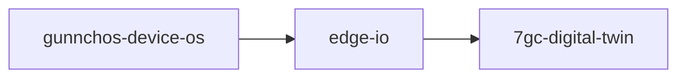

# Edge-IO Measurement Node
## End-to-End Research Artifact

| Item | Detail |
|------|--------|
| **Runs today** | Research prototype with smoke test (synthetic, non-evidence) |
| **Demo** | `make smoke` (smoke test only — not readiness proof) |
| **Data** | Synthetic only — no private IQ or PII |
| **Extend** | See [EXTERNAL_RESEARCHER_QUICKSTART.md](docs/EXTERNAL_RESEARCHER_QUICKSTART.md) |
| **Limits** | Not operational 6G; not Oulu affiliation; not carrier-grade |
| **Readiness** | [END_TO_END_READINESS.md](docs/END_TO_END_READINESS.md) |
| **Smoke test** | [E2E_RUN_RECORD.md](reproducibility/E2E_RUN_RECORD.md) |
| **Artifacts** | [results/e2e/](results/e2e/) |

Reframes **Edge-IO** and gunnchOS devices as **low-cost edge measurement endpoints** for 6G education, AI inference, and network quality measurement.

> **Research prototype** — not certified consumer hardware. All collection **opt-in** and **privacy-preserving**.


---

## What is this?

**Capture privacy-first edge network experience metrics to calibrate digital twins—not synthetic-only forever.**

| | |
|---|---|
| **Status** | Evidence-building measurement prototype |
| **Evidence today** | Level 1 smoke test — see [Evidence status](#evidence-status-smoke-test-vs-real-validation) |
| **Start** | [docs/START_HERE.md](docs/START_HERE.md) |

## What problem does this solve?

**Human:** Twins without real device experience misrepresent latency and outages communities actually feel.

**Technical:** Schema-validated, consent-gated telemetry export to 7GC.

**Who is harmed if unsolved:** Students and residents if measurements leak PII or mislead planners.

**Gary / 7GC / digital equality:** This repo supports equitable connectivity research for under-connected communities; Gary is the flagship urban anchor where applicable.

## Beginner mental model

A **fitness tracker for network experience**, with consent and deletion built in.

## How this repo addresses the problem

Telemetry schema, privacy helpers, demo/smoke generator, 7GC export contract.

**Main output:** Synthetic smoke packets + export JSON (not field-validated until real clients ship).

**Output does NOT prove:** Representative city-wide measurement campaign.

## How this fits gunnchOS3k MLV

Sensory layer for 7GC; connects device OS and field pilots.

Deep dive: [docs/HOW_THIS_FITS_GUNNCHOS.md](docs/HOW_THIS_FITS_GUNNCHOS.md) · [docs/CROSS_REPO_DEPENDENCY_MAP.md](docs/CROSS_REPO_DEPENDENCY_MAP.md) (where present)

## How this fits 6G PhD research

Relevant themes: **Edge AI measurement · trust/privacy · digital twin calibration · ubiquitous connectivity**

Oulu/CWC-style alignment (research direction, not affiliation claim): [docs/HOW_THIS_FITS_6G_PHD_RESEARCH.md](docs/HOW_THIS_FITS_6G_PHD_RESEARCH.md)

## What exists today

- Python package
- Privacy fields
- 7GC export
- `make smoke`

Details: [docs/WHAT_IS_REAL_TODAY.md](docs/WHAT_IS_REAL_TODAY.md)

## Evidence status: smoke test vs real validation

- `make smoke` / `make e2e` = **CI smoke test** — proves code runs, **not** that research claims are field-validated.
- See [docs/NO_MORE_TOY_DEMOS.md](docs/NO_MORE_TOY_DEMOS.md) · [docs/EVIDENCE_STANDARD.md](docs/EVIDENCE_STANDARD.md) · [quality/CLAIMS_TO_EVIDENCE_MATRIX.md](quality/CLAIMS_TO_EVIDENCE_MATRIX.md)

**Next real evidence needed:**

- Real app/device client
- Consent UX
- Schema validation on real data
- School privacy review

## Run or inspect this repo

```bash
python3 -m venv .venv && source .venv/bin/activate
pip install -r requirements.txt
make smoke
```

| | |
|---|---|
| **Output** | `results/e2e/ telemetry export sample` |
| **Means** | Reproducible smoke artifacts for CI and reviewers |
| **Does not mean** | Conference, adoption, or manufacturing readiness |

Video: [docs/video_walkthrough_script.md](docs/video_walkthrough_script.md)

## Visual map



More diagrams: [docs/diagrams/README.md](docs/diagrams/README.md) (if present) · [docs/uml/README.md](docs/uml/README.md) (spectrumx)

## Start here based on who you are

| Reader | Start here | You will learn |
|--------|------------|----------------|
| Beginner | [docs/PLAIN_ENGLISH_EXPLANATION.md](docs/PLAIN_ENGLISH_EXPLANATION.md) | Idea without jargon |
| Student / WAIKE | [docs/AUDIENCE_GUIDE.md](docs/AUDIENCE_GUIDE.md) | Learning path |
| Researcher / professor | [docs/HOW_THIS_FITS_6G_PHD_RESEARCH.md](docs/HOW_THIS_FITS_6G_PHD_RESEARCH.md) | Research fit |
| Contributor | [CONTRIBUTING.md](CONTRIBUTING.md) or Issues | How to help |
| City / school partner | [docs/PROBLEM_SOLUTION_MAP.md](docs/PROBLEM_SOLUTION_MAP.md) | Why it matters locally |

## What would make this final?

**Not satisfied yet** for final / conference / adoption / manufacturing gates—see audit:

- [docs/WHAT_WOULD_MAKE_THIS_FINAL.md](docs/WHAT_WOULD_MAKE_THIS_FINAL.md)
- [quality/FINAL_READINESS_CONFIRMATION.md](quality/FINAL_READINESS_CONFIRMATION.md)

## Roadmap from current state to final readiness

| Gate | Status |
|------|--------|
| Concept | Met |
| Smoke test | Met (`make smoke`) |
| Real evidence pipeline | Open |
| Benchmark / field data | Open |
| Internal validation | Open |
| External reproduction | Open |
| Candidate release | Open |
| Final | Not claimed |

Full table: [quality/READINESS_GATE_TABLE.md](quality/READINESS_GATE_TABLE.md)

## Related repos in the 7GC research spine


| Repo | Role |
|------|------|
| [7gc-digital-twin](https://github.com/gunnchOS3k/7gc-digital-twin) | Community digital twin spine |
| [spectrumx-ai-ran-gary](https://github.com/gunnchOS3k/spectrumx-ai-ran-gary) | AI-RAN + SpectrumX competition path |
| [readygary-6g-beam-selection](https://github.com/gunnchOS3k/readygary-6g-beam-selection) | Beam selection / PHY-facing evidence |
| [edge-io-measurement-node](https://github.com/gunnchOS3k/edge-io-measurement-node) | Privacy-first edge measurement |
| [ntn-resilience-sim](https://github.com/gunnchOS3k/ntn-resilience-sim) | NTN + terrestrial resilience |
| [waike-research-ops](https://github.com/gunnchOS3k/waike-research-ops) | Education & workforce pipeline |
| [gunnchos-hardware-industrial-design](https://github.com/gunnchOS3k/gunnchos-hardware-industrial-design) | Device hardware EVT planning |
| [gunnchos-device-os](https://github.com/gunnchOS3k/gunnchos-device-os) | School/research device OS prototype |
| [gunnchAI3k](https://github.com/gunnchOS3k/gunnchAI3k) | Learning assistant (where relevant) |


## Claims and non-claims

**Supports today:** Runnable scaffold, documented methods, smoke-test artifacts, honest limitations.

**Does not prove yet:** Representative city-wide measurement campaign.

**Requires evidence issues:** See GitHub `[Evidence TODO]` issues and `quality/CLAIMS_TO_EVIDENCE_MATRIX.md`.

---

## Measures (planned)

Latency, jitter, packet loss, RSSI, device temperature, CPU/GPU utilization, offline AI timing, interaction traces (aggregated).

## 7GC spine

Exports to [7gc-digital-twin](https://github.com/gunnchOS3k/7gc-digital-twin) via `export_to_7gc.py` contract.

```bash
pip install -r requirements.txt && pytest -q
```

## Industry / research-grade tooling alignment

| Tool / ecosystem | Why it matters | Adapter | Runs now? | Access? |
|------------------|----------------|---------|-----------|---------|
| See matrix | Evidence upgrade path | `industry_research_stack/` | Stub exports | Optional |

**Commands:** `make e2e` (includes tool export stubs) · `python3 scripts/run_all_tool_exports.py`

**Notice:** Aligned with public research ecosystems — [non-affiliation](industry_research_stack/NON_AFFILIATION_NOTICE.md). Smoke stubs only unless documented otherwise.

