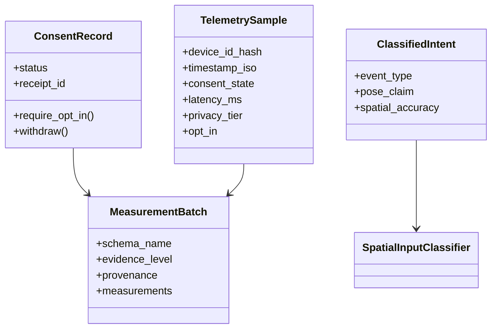

# Class — telemetry / schema (current)

```mermaid
classDiagram
  class TelemetrySample {
    +device_id_hash
    +timestamp_iso
    +consent_state
    +latency_ms
    +privacy_tier
    +opt_in
  }
  class ConsentRecord {
    +status
    +receipt_id
    +require_opt_in()
    +withdraw()
  }
  class MeasurementBatch {
    +schema_name
    +evidence_level
    +provenance
    +measurements
  }
  class ClassifiedIntent {
    +event_type
    +pose_claim
    +spatial_accuracy
  }
  ConsentRecord --> MeasurementBatch
  TelemetrySample --> MeasurementBatch
  ClassifiedIntent --> SpatialInputClassifier
```

`pose_claim` is always `relative_cues_only_not_absolute_pose` in software.
