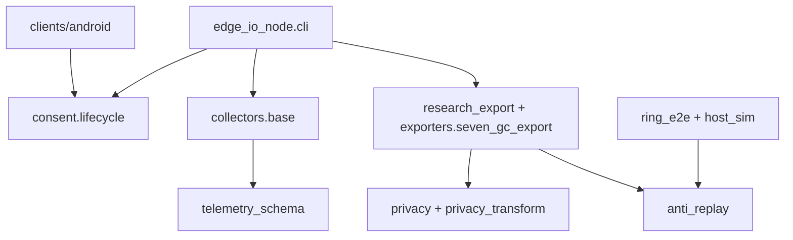

# Component — current

```mermaid
flowchart TB
  CLI[edge_io_node.cli]
  CONS[consent.lifecycle]
  COL[collectors.base]
  TEL[telemetry_schema]
  PRIV[privacy + privacy_transform]
  AR[anti_replay]
  EXP[research_export + exporters.seven_gc_export]
  RING[ring_e2e + host_sim]
  AND[clients/android]
  CLI --> CONS
  CLI --> COL
  COL --> TEL
  CLI --> EXP
  EXP --> PRIV
  EXP --> AR
  RING --> AR
  AND --> CONS
```

PhysicalDeviceCollector fails closed if the probe endpoint is unreachable. Emulator output cannot be labeled `controlled_device_measurement`.
