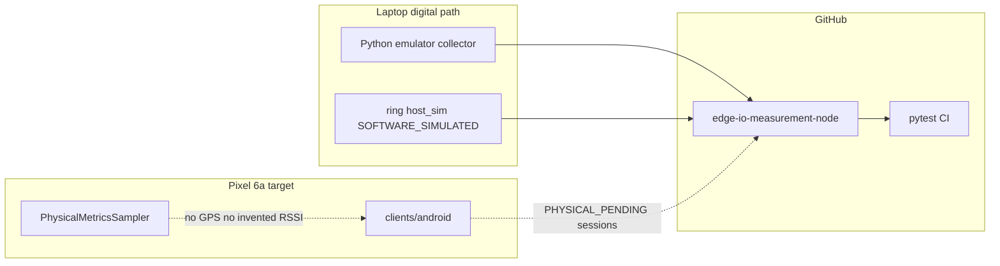

# Deployment — device / edge (current)

```mermaid
flowchart LR
  subgraph laptop [Laptop digital path]
    PY[Python emulator collector]
    FW[ring host_sim SOFTWARE_SIMULATED]
  end
  subgraph phone [Pixel 6a target]
    APK[clients/android]
    SAM[PhysicalMetricsSampler]
  end
  subgraph git [GitHub]
    REPO[edge-io-measurement-node]
    GHA[pytest CI]
  end
  PY --> REPO
  FW --> REPO
  APK -.->|PHYSICAL_PENDING sessions| REPO
  SAM -.->|no GPS no invented RSSI| APK
  REPO --> GHA
```

No ring is required to reproduce the digital path. Pixel 6a is a **target**, not a completed acceptance campaign in this tree.
