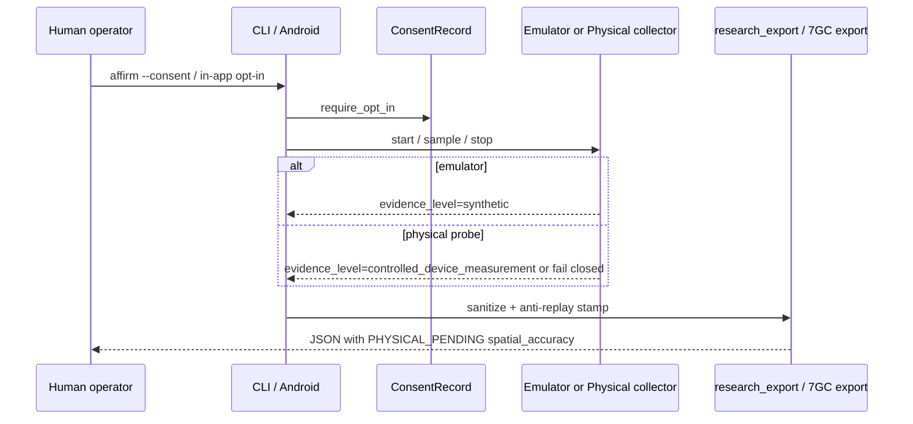

# Sequence — sensing (current)

```mermaid
sequenceDiagram
  participant H as Human operator
  participant C as CLI / Android
  participant S as ConsentRecord
  participant E as Emulator or Physical collector
  participant X as research_export / 7GC export
  H->>C: affirm --consent / in-app opt-in
  C->>S: require_opt_in
  C->>E: start / sample / stop
  alt emulator
    E-->>C: evidence_level=synthetic
  else physical probe
    E-->>C: evidence_level=controlled_device_measurement or fail closed
  end
  C->>X: sanitize + anti-replay stamp
  X-->>H: JSON with PHYSICAL_PENDING spatial_accuracy
```
