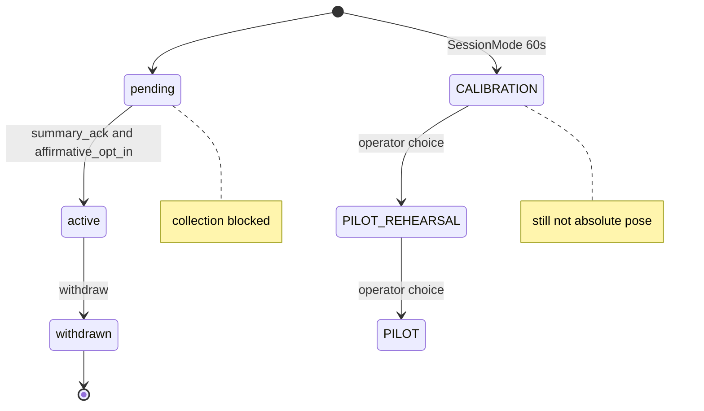

# State — consent and calibration (current)

```mermaid
stateDiagram-v2
  [*] --> pending
  pending --> active: summary_ack and affirmative_opt_in
  active --> withdrawn: withdraw
  withdrawn --> [*]
  note right of pending: collection blocked
  [*] --> CALIBRATION: SessionMode 60s
  CALIBRATION --> PILOT_REHEARSAL: operator choice
  PILOT_REHEARSAL --> PILOT: operator choice
  note right of CALIBRATION: still not absolute pose
```
