# Timing — current

```mermaid
gantt
  title Digital session timing (emulator or Pixel)
  dateFormat  s
  axisFormat  %S
  section Consent
  opt-in gate           :a1, 0, 1
  section Sampling
  interval loop         :a2, 1, 31
  section Export
  sanitize + anti-replay :a3, 31, 33
```

CLI defaults: `--duration` 300 s (pilot) or 60 s (Android CALIBRATION); `--interval` 30 s. Emulator tests may compress this. Timing is wall-clock of the collector, not a PHY slot grid.
