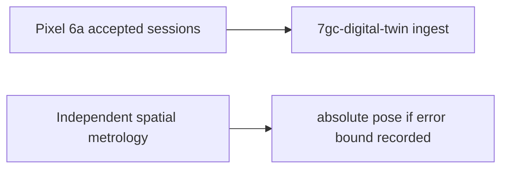

# Future — physical campaign

```mermaid
flowchart LR
  P6[Pixel 6a accepted sessions] --> TWIN[7gc-digital-twin ingest]
  MET[Independent spatial metrology] --> POSE[absolute pose if error bound recorded]
```

Blocked on `docs/PIXEL_6A_ACCEPTANCE.md` and `docs/PHYSICAL_CALIBRATION_PROCEDURE.md` execution.
